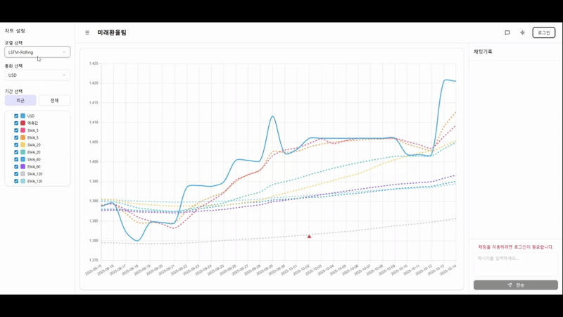
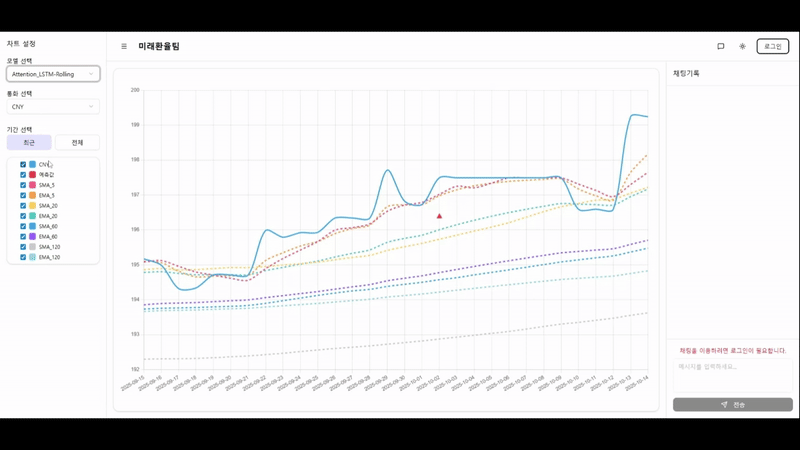
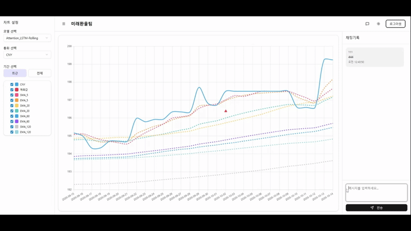

# 📈 환율 변동 추이 분석 및 예측 시스템

최근 심화되는 경제 불확실성과 확대되는 환율 변동성에 대응하기 위해, 주요 경제 지표를 자동으로 수집하고 머신러닝 모델을 활용하여 미래 환율을 예측하는 자동화 시스템

- **Project Period**: 2025.09.01 \~ 2025.10.15

<br>

## 👨‍💻 각 팀원들 역할

- **팀장**: **백인호** (리서치, 데이터 수집/전처리, 모델링, 시각화, Full-Stack 개발, PPT)
- **팀원**:
  - **이병철**: 리서치, WBS 작성, PPT 작성
  - **이주영**: 리서치, 데이터 수집/전처리, 모델링, 시각화, PPT 작성
  - **이지석**: Full-Stack 개발, 배포, 코드 최적화, 아키텍트, GitActions 워크플로우 작성
  - **최홍석**: 리서치, 데이터 수집/전처리, 모델링, 시각화, PPT 작성

## 🛠️ 기술 스택

| Category                          | Skills                                    |
| --------------------------------- | ----------------------------------------- |
| **Backend**                       | FastAPI, WebSocket                        |
| **Frontend**                      | React, shadcn/ui, React Query, Zustand    |
| **Database / Cache**              | MongoDB, Redis                            |
| **Messaging / Streaming**         | Kafka                                     |
| **ML / DL**                       | PyTorch, TensorFlow, Scikit-learn, Optuna |
| **Data Analysis / Visualization** | Pandas, NumPy, Matplotlib, Plotly         |
| **CI/CD**                         | Docker, GitHub Actions                    |
| **Infra / Networking**            | Reverse Proxy (Nginx)                     |

## 🚀 실행 방법

```sh
docker-compose up -d --build
```

- 위 명령어 실행 후, 브라우저에서 http://localhost 로 접속하면 대시보드를 확인할 수 있습니다.

## 📷 UI 화면 구성

- ### 1. 모델 + 통화 선택

  

- ### 2. 지표 ON/OFF

  

- ### 3. 실시간 채팅

  

## ⚙️ 시스템 아키텍처 및 프로세스

1.  **데이터 수집**

    - `GitHub Actions`를 활용해 매일 지정된 시간에 Python 스크립트(`collector.py`, `predictor.py`)를 실행하여 환율 & 경제지표를 자동으로 수집 후 미리 학습해둔 모델로 예측합니다.

2.  **데이터 저장**

    - 수집된 환율 & 경제지표 & 예측값 데이터는 `MongoDB` 데이터베이스에 저장됩니다.
    - 저장된 데이터를 불러올땐 결측치 처리(`ffill`), 데이터 병합 등 분석에 적합한 형태로 가공합니다.

3.  **모델학습**

    - **3-Track 모델 비교**: `XGBoost`, `LSTM`, `Attention-LSTM` 세 가지 모델을 학습시켰습니다.
    - 시계열 데이터의 시간적 순서를 유지하며 모델의 안정성을 검증하기 위해 **Rolling Window 교차 검증** 방식을 적용했습니다.

4.  **대시보드**

    - `MongoDB`에 저장된 예측값 데이터를 `FastAPI` 기반의 API 서버를 통해 제공합니다.
    - 사용자는 `React`와 `Chart.js`로 구현된 대시보드에서 최신 예측 결과를 시각적으로 확인할 수 있습니다.

---

## 🎯 분석 대상 및 범위

- **예측 대상 통화**: `USD` (달러), `EUR` (유로), `JPY` (엔), `CNY` (위안) 4개 주요 통화.
- **주요 독립 변수**: 각 통화별 특성을 고려하여 다음과 같은 경제 지표를 독립 변수로 설정했습니다.
  - **USD**: 미 10년물 국채 수익률(DGS10), 변동성 지수(VIX), 달러 지수(DXY), 한/미 기준금리 및 금리차.
  - **EUR**: 유로존 10년물 국채 수익률(EUR10), 달러 지수(DXY), 미/유로존 국채 금리차, VIX.
  - **JPY**: 일 10년물 국채 수익률(JPY10), 미 10년물 국채 수익률(DGS10), 미/일 국채 금리차, VIX.
  - **CNY**: 중국 외환보유액, 무역수지, 국제 유가(WTI), VIX.

---

## 📊 모델 성능

| Currency | Model              |   **R²**   | **MAPE (%)** | **RMSE**  |
| :------: | :----------------- | :--------: | :----------: | :-------: |
| **USD**  | XGBoost            |   0.9991   |     0.07     |   1.30    |
|          | LSTM               |   0.9559   |     1.28     |   20.31   |
|          | **Attention-LSTM** | **0.9308** |   **1.55**   | **26.18** |
| **EUR**  | XGBoost            |   0.9556   |     0.06     |   1.16    |
|          | LSTM               |   0.9382   |     0.84     |   15.27   |
|          | **Attention-LSTM** | **0.9143** |   **0.98**   | **17.04** |
| **CNY**  | XGBoost            |   0.9991   |     0.05     |   0.12    |
|          | LSTM               |   0.9746   |     0.63     |   1.53    |
|          | **Attention-LSTM** | **0.9801** |   **1.23**   | **1.23**  |
| **JPY**  | XGBoost            |   0.9889   |     0.26     |   3.06    |
|          | LSTM               |   0.9763   |     0.97     |   12.51   |
|          | **Attention-LSTM** | **0.9746** |   **0.93**   | **12.16** |
